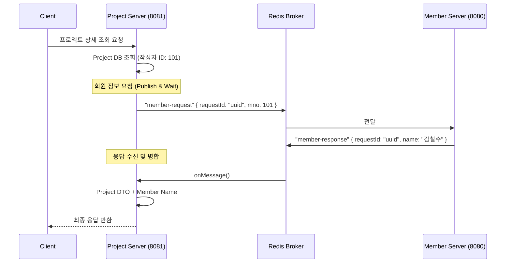

-----

# 🏭 LC-Eye Project Server – LCI 계산 및 프로젝트 관리 엔진

> **전과정평가(LCA)의 핵심 연산과 대용량 데이터 처리를 담당하는 마이크로서비스** <br>
> 🔗 [프로젝트 노션 바로가기](https://lceye.notion.site/LC-Eye-2a2094d4983480369aa4fe1a6163688f) <br>
> 🔗 단일 서버용 GitHub [GitHub 바로가기](https://github.com/JeonghoonAHN0510/LC-Eye) <br>
> 🔗 다중 서버용 GitHub [Back_Member](https://github.com/JeonghoonAHN0510/LC-Eye_Member) &nbsp;|&nbsp; [Back_Project](https://github.com/JeonghoonAHN0510/LC-Eye_Project) &nbsp;|&nbsp; [React](https://github.com/JeonghoonAHN0510/LC-Eye_React) &nbsp;|&nbsp; [Flutter](https://github.com/msh-94/lc_eye_project) <br>

-----

## 🧭 프로젝트 개요

**LC-Eye**는 제품·공정 단위의 투입물·산출물 데이터를 기반으로 환경부하를 정량화하는 툴입니다.
서비스의 확장성과 유지보수성을 높이기 위해 \*\*Member Server(회원/인증)\*\*와 \*\*Project Server(계산/관리)\*\*로 백엔드를 분리하였으며, **Redis Pub/Sub**를 통해 서버 간 데이터 정합성을 유지합니다.

프론트엔드는 **React**로 구축하여 SPA(Single Page Application) 기반의 끊김 없는 사용자 경험을 제공하며, 대용량 데이터 처리와 실시간 상호작용에 최적화된 아키텍처를 갖추고 있습니다.

  - **개발기간:** 2025.11.05 \~ 2025.11.27 (3주)
  - **팀명:** LC-Eye
  - **인원:** 3명
    - 옹태경 - **팀장** / LCI 계산 로직 / S3 파일 처리 / Front 총괄 / 발표
    - 민성호 - **JSON 추천 로직** / 투입물·산출물·process 로직 / Flutter 총괄
    - 안정훈 - **MSA 기반 서버 분리** / 서버 간 통신 / Redisson 분산 락 / 버전 관리 / Front 공통 레이아웃

-----

## 🚀 핵심 목표

| 구분 | 설명 |
|------|------|
| 🧮 **LCI 계산 엔진** | 사용자가 구성한 투입/산출물 트리와 DB의 프로세스 정보를 결합하여 환경 부하량을 자동으로 계산하고 JSON 결과 파일 생성 |
| ☁️ **하이브리드 스토리지** | 정형 데이터(프로젝트 메타정보)는 MySQL에, 비정형 대용량 데이터(Exchange/Result JSON)는 AWS S3에 분리 저장하여 DB 부하 감소 |
| 🤖 **지능형 데이터 매칭** | 사용자가 입력한 한글 자재명을 **Gemini API**로 번역 후, **Jaro-Winkler 알고리즘**으로 기존 프로세스와 유사도를 분석하여 자동 매칭 |
| 🔒 **동시성 제어** | `@DistributedLock` AOP를 적용하여, 다수의 사용자가 동시에 동일한 프로젝트를 수정하거나 계산할 때 발생하는 **Race Condition** 원천 차단 |

-----

## ⚙️ 개발환경

| 분류 | 기술 스택 |
|------|-------------|
| **Framework** | Java 17, Spring Boot |
| **Database** | MySQL (Metadata), **AWS S3** (JSON Storage), **Redis** (Lock/Pub-Sub) |
| **External API** | **Gemini API** (Translation) |
| **Utility** | **Redisson** (Distributed Lock), Apache POI (Excel), Jackson |
| **Architecture** | MVC, AOP, Event-Driven (Redis Pub/Sub) |

-----

## 🧱 아키텍처 및 통신 구조

### 🔄 Redis Pub/Sub Requester (요청자)

Project 서버는 자체 DB에 없는 회원 정보를 조회하기 위해 **Redis Message Broker**를 사용합니다.

1.  **발행 (Publish):** 프로젝트 조회 시 작성자 정보가 필요하면 `member-request` 채널로 메시지(UUID 포함)를 발행합니다.
2.  **대기 (Wait):** `CompletableFuture`를 사용하여 응답이 올 때까지 비동기적으로 대기합니다.
3.  **수신 (Listen):** Member Server가 `member-response` 채널로 응답하면, UUID를 매칭하여 대기 중이던 스레드를 깨웁니다.
4.  **병합 (Merge):** 프로젝트 DTO에 수신한 회원 정보를 병합하여 클라이언트에 반환합니다.

<!-- end list -->



-----

## 🧩 주요 기능 및 API

### 1\. LCI 계산 서비스 (`LCICalculateService`)

  - **계산 로직:** S3에서 프로젝트의 `Exchange JSON`을 다운로드하고, 연관된 `Process JSON`들을 재귀적으로 탐색하여 총 환경 영향을 합산합니다.
  - **캐싱 최적화:** 계산 중 중복되는 프로세스 정보는 로컬 메모리(Map)에 캐싱하여 S3 I/O 비용을 획기적으로 줄였습니다.

### 2\. 투입·산출물 관리 (`ExchangeService`)

  - **JSON 관리:** 사용자가 정의한 공정 데이터를 S3에 JSON 파일로 업로드/다운로드합니다.
  - **자동 추천:** 사용자가 "경유"를 입력하면 -\> "Diesel"로 번역 -\> DB의 "Diesel B7" 프로세스와 매칭하여 추천해줍니다.

### 3\. 엑셀 리포팅 (`ExcelService`)

  - **Apache POI 활용:** 프로젝트 개요, 투입/산출 내역, LCI 결과를 각각의 시트로 분리하여 스타일이 적용된 엑셀 파일로 생성 및 다운로드 제공

### 4\. 분산 락 (`DistributedLock`)

  - **AOP 적용:** 비즈니스 로직에 `@DistributedLock(key = "#pjno")` 어노테이션만 붙이면, Redisson이 자동으로 락을 획득하고 해제합니다.
  - **안전성:** 락 획득 대기 시간(Wait Time)과 임대 시간(Lease Time)을 설정하여 데드락을 방지합니다.

-----

## 🔍 디렉토리 구조

```bash
LC-Eye_Project/src/main/java/lceye/
├── config/                        # S3, Redis, CORS 설정
├── controller/                    # 프로젝트, 계산, 엑셀 API
│   ├── LCICalculateController.java
│   ├── ProjectController.java
│   └── ...
├── model/
│   ├── dto/                       # Data Transfer Objects
│   ├── entity/                    # Project, ProcessInfo 등 DB 엔티티
│   └── repository/                # JPA Repositories
├── service/                       # 핵심 비즈니스 로직
│   ├── LCICalculateService.java   # 계산 엔진
│   ├── ExchangeService.java       # 투입산출 및 매칭
│   ├── RedisService.java          # Pub/Sub 통신
│   └── TranslationService.java    # DeepL 번역
└── util/
    ├── aop/                       # 분산 락 AOP
    └── file/                      # S3 파일 처리 유틸리티
```

-----

## 🏁 마무리

> **LC-Eye Project Server**는 단순한 CRUD 서버를 넘어, **복잡한 연산과 대용량 데이터 처리, 그리고 분산 환경에서의 동시성 제어**까지 고려된 백엔드 시스템입니다. S3와 Redis를 적재적소에 활용하여 성능과 안정성을 동시에 확보하였습니다.
>
> **- LC-Eye 개발팀**
